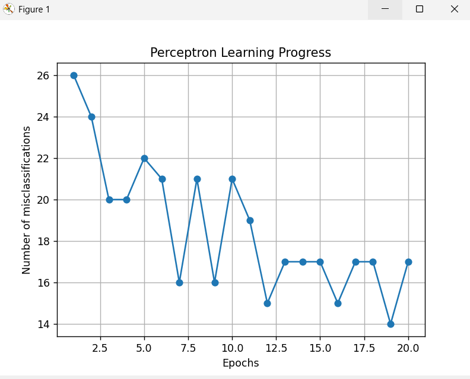
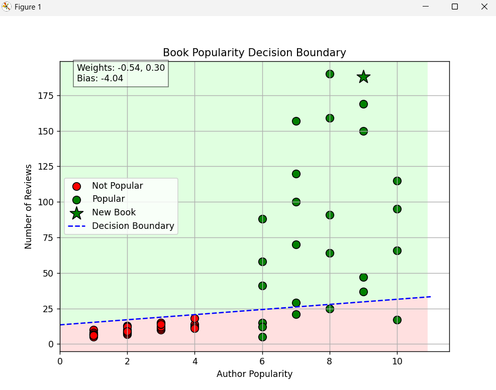

# Lab02 - Perceptron: Book Popularity Prediction  

This project implements a **Perceptron algorithm** to predict whether a book will be **Popular** or **Not Popular** based on:  

- **Author Popularity (1–10)**  
- **Number of Reviews**  

The program trains the perceptron, shows the **learning progress**, then allows the user to test a new book and see its position on the decision boundary plot.  

---

## 🚀 Program Flow
1. **Training Phase**  
   - The perceptron learns from training data.  
   - A plot of **errors per epoch** is displayed to show learning progress.  

2. **User Input**  
   - The program asks for:  
     - Author popularity (1–10)  
     - Number of reviews (≥ 0)  
   - The perceptron makes a prediction:  
     - 🟢 **Popular**  
     - 🔴 **Not Popular**  

3. **Visualization**  
   - The decision boundary is displayed.  
   - Existing books are shown in **red (Not Popular)** or **green (Popular)**.  
   - The new book is highlighted as a **large star (⭐)**:  
     - Green star → Popular prediction  
     - Red star → Not Popular prediction  

---

## 📸 Screenshots  

### Learninig Progress  
_Shows how errors decrease over epochs._  
  
 

### Decision Boundary with New Book  
_The new book is marked as a star (⭐), green if popular and red if not popular._  
  

---

## How to Run
1. Clone the repository:  
   ```bash
   git clone <your-repo-link>
   cd Lab02
2.Install requirements:
 pip install numpy matplotlib
3.Run the program


## Learning Outcome

From this exercise, I learned how to:

Train a perceptron and observe its learning progress.

Use decision boundaries to separate data into classes.

Accept user input to test new predictions.

Visualize predictions clearly with colors and markers.
